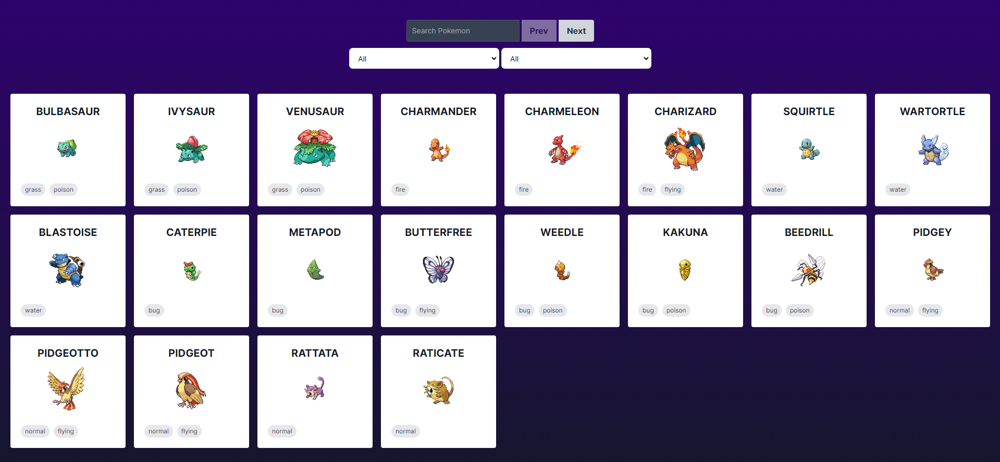

# Poke Binpar App

## Initialize the project

To initialize the project, at least node.js version >18 is required.

- You need the environment variable where the api is hosted, configured as API_BASE ( Check .env.example file ).

- npm install
- npm run build
- npn run start

The technologies used to perform the application were ([T3 Stack](https://create.t3.gg/)):

- [Next.js](https://nextjs.org)
- [Tailwind CSS](https://tailwindcss.com)
- [tRPC](https://trpc.io)
- [Zustand](https://github.com/pmndrs/zustand)
